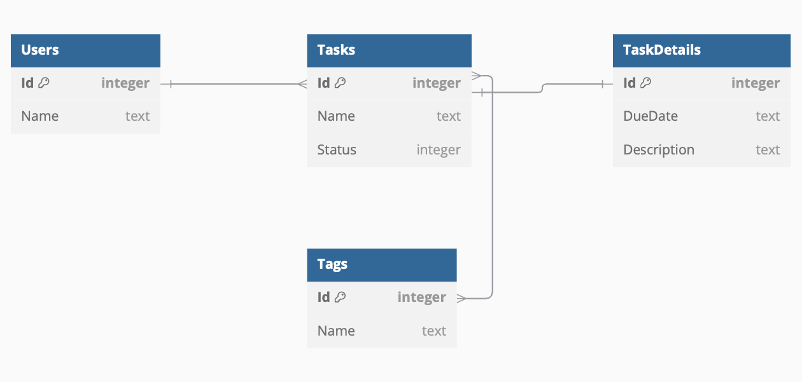
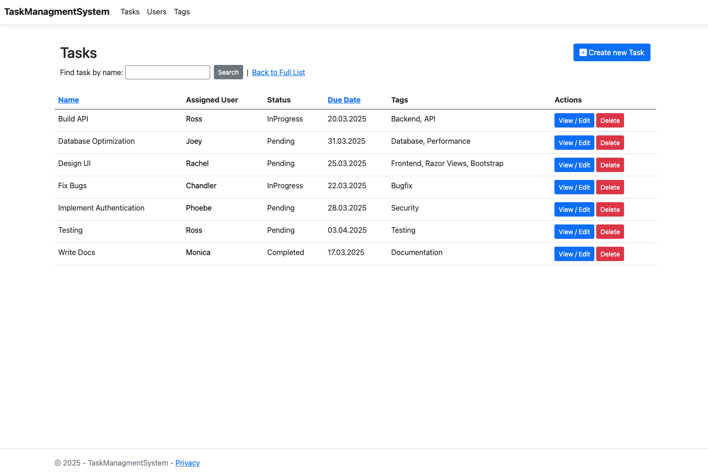
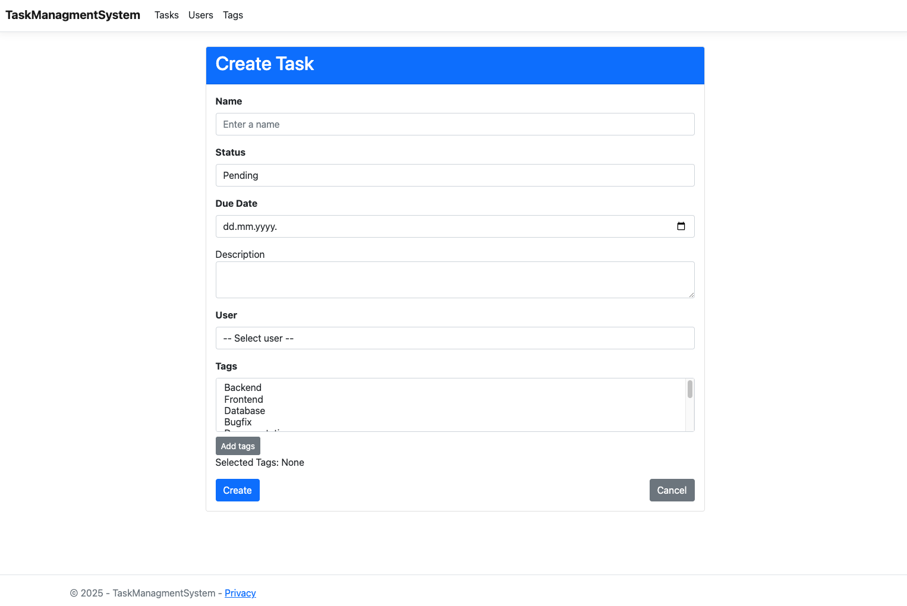
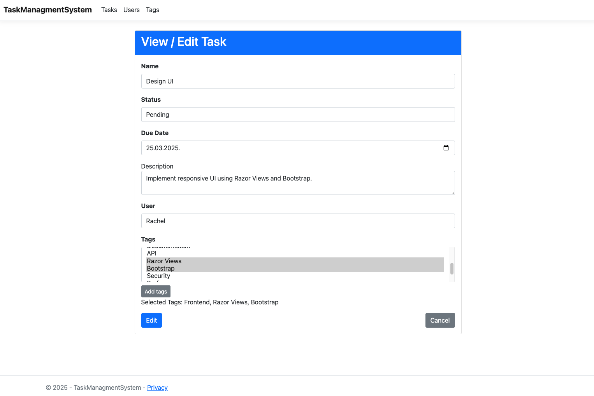
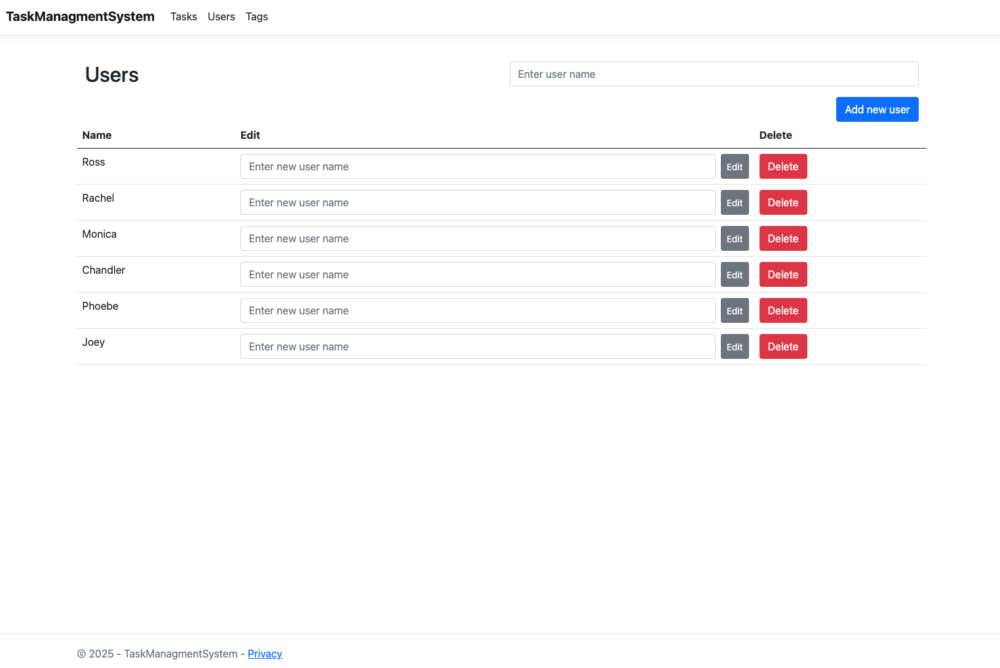
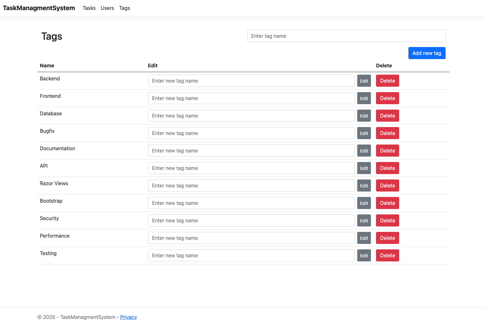

# Task Management System
A Task Management System can be used to track tasks, their details, associated tags and assigned users. The system allows users to create, update, and manage tasks, including due dates and task statuses.

## Features
- **Task Creation & Management:** Users can create tasks with a name, status and description.
- **Task Details:** Each task can have additional details like due dates and descriptions.
- **Tags:** Tasks can be tagged with multiple tags to categorize them.
- **Users:** Tasks can be assigned to users who are responsible for completing them.
- **Sorting and filtering:** Tasks can be sorted by name or due date and filtered by name.

## Technologies Used
- **ASP.NET Core MVC:** Framework for building the web application.
- **SQLite:** Database to store task-related data.
- **Entity Framework Core:** ORM for database management.
- **HTML/CSS/JavaScript:** Front-end technologies to structure and style the web pages.

## Database Structure & Relationships
- **Task & TaskDetail (One-to-One):** Each task has one task detail containing additional information.
- **Task & User (Many-to-One):** Each task is assigned to one user, but a user can have multiple tasks.
- **Task & Tag (Many-to-Many):** Task can have multiple tags and a tag can be associated with multiple tasks.

Database diagram

 

## Screenshots

### Task List View

Shows all tasks with sorting and filtering options.

 

### Task Creation Form

Create a new task by filling out the form.

 

### Task View/Edit Form

View and edit task details, including due dates, descriptions and assigned tags.

 

### Users Page

Displays a list of all users with options to add, edit, or delete them.

 

### Tags Page

Displays a list of all tags with options to add, edit, or delete them.

 

